# HirePing - Flow Diagrams

All user interactions, API calls, and data flows visualized with Mermaid.

---

## 1. Complete User Journey (High Level)

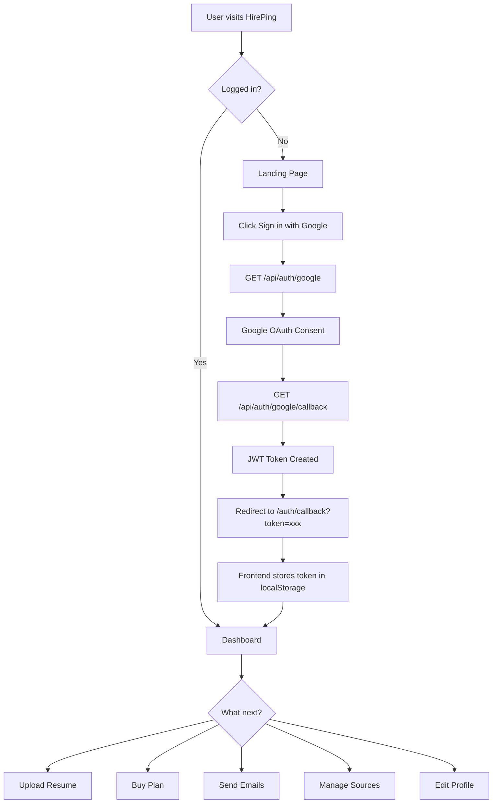

---

## 2. Authentication Flow

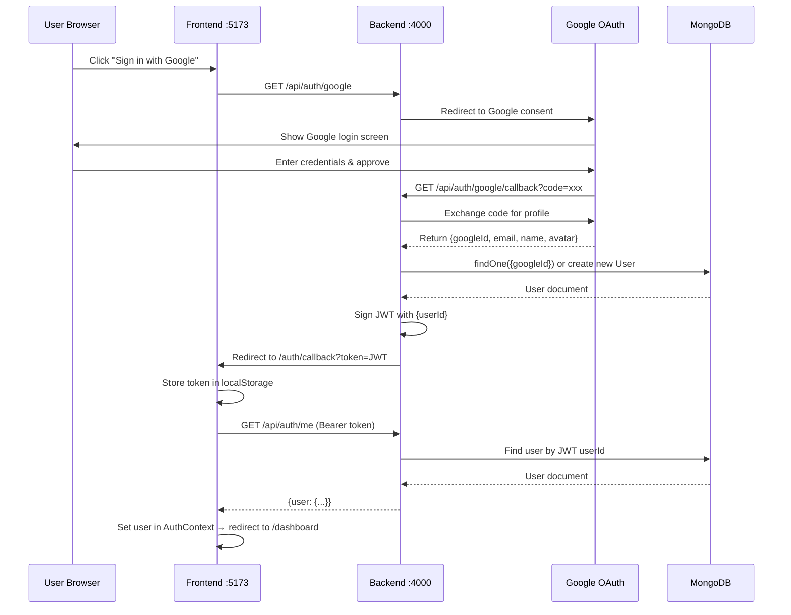

**Bruno test:** `auth/get-me.bru` — paste your JWT token in environment

---

## 3. Resume Upload & Profile Flow

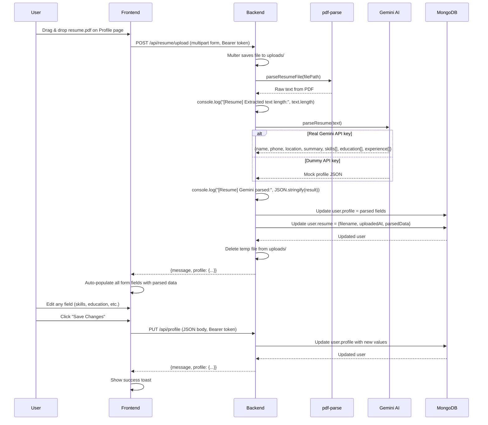

**Bruno test:**
- `resume/upload-resume.bru` — upload a PDF
- `profile/get-profile.bru` — see parsed data
- `profile/update-profile.bru` — edit fields

---

## 4. Plan Purchase Flow

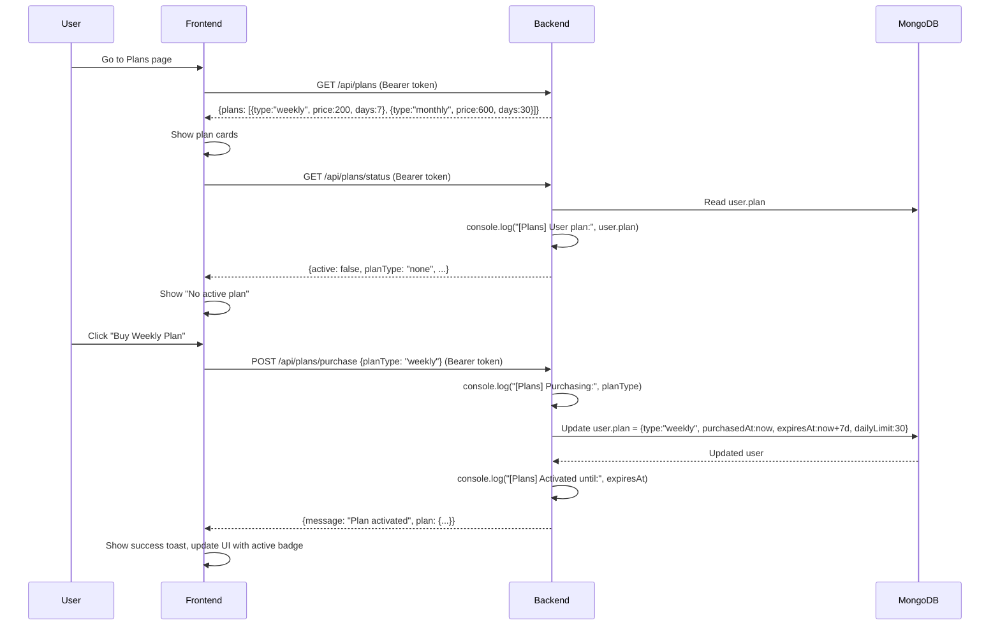

**Bruno test:**
- `plans/get-plans.bru` — see available plans
- `plans/purchase-plan.bru` — buy weekly plan
- `plans/get-status.bru` — verify it's active

---

## 5. Source Sync Flow

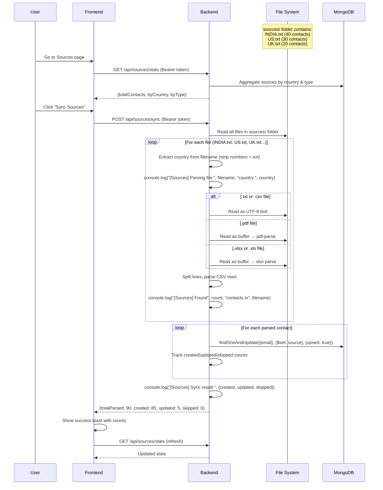

**Source file format examples:**
```
# Full CSV (best)
name,email,role,company,companyType
Priya Sharma,priya@infosys.com,HR Manager,Infosys,mnc

# Minimal (just emails, one per line)
hr@startup.com
recruiter@techcorp.com

# Partial (name + email only)
Priya Sharma,priya@infosys.com
```

**Bruno test:**
- `sources/sync-sources.bru` — sync all files
- `sources/get-countries.bru` — see countries
- `sources/get-stats.bru` — see counts

---

## 6. Email Sending Flow (Core Business Logic)

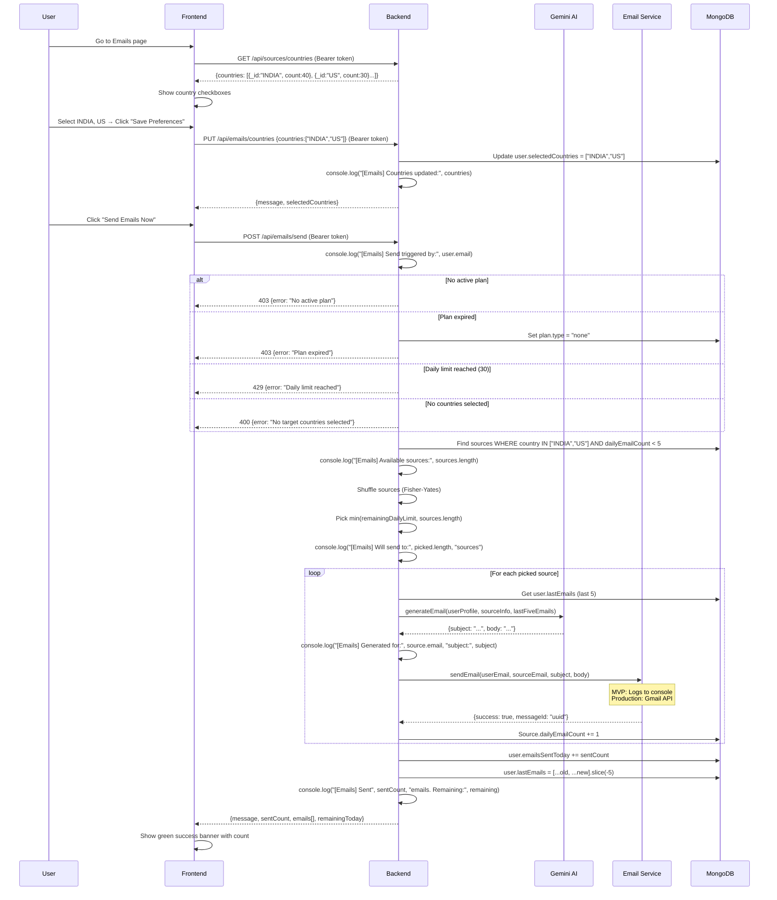

**Bruno test flow (in order):**
1. `plans/purchase-plan.bru` — activate a plan first
2. `emails/update-countries.bru` — select target countries
3. `emails/send-emails.bru` — trigger send
4. `emails/get-history.bru` — see sent emails
5. `emails/get-stats.bru` — see counts

---

## 7. Anti-Bombarding Algorithm

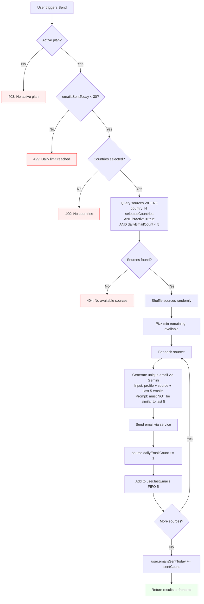

**Key protection rules:**
- Each **user** can send max **30 emails/day**
- Each **source** (HR/Manager) receives max **5 emails/day** across ALL users
- Daily counters reset at midnight (manual reset or future cron)
- Last 5 emails tracked per user for **uniqueness** — Gemini avoids repetition

---

## 8. Frontend Page Navigation

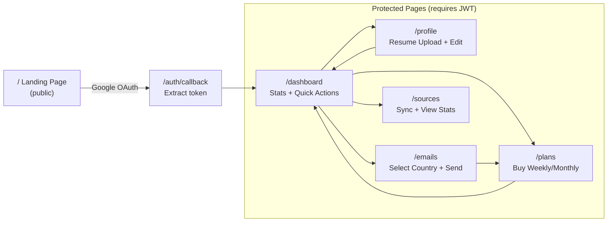

---

## 9. Data Model Relationships

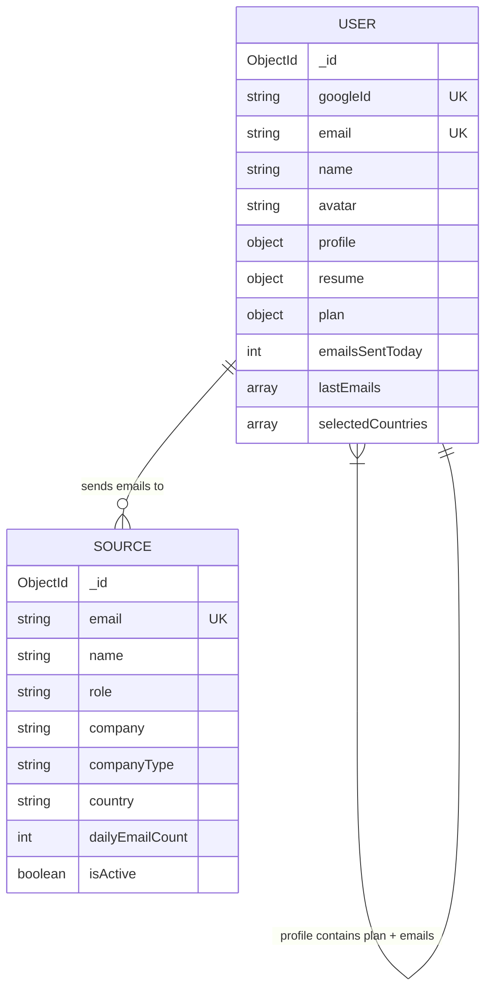

**user.profile fields:**
```
phone, location, summary, skills[],
education[{degree, institution, year}],
experience[{title, company, duration, highlights[]}]
```

**user.lastEmails[] (FIFO, max 5):**
```
{to, subject, body, sentAt}
```

---

## 10. API Endpoint Map

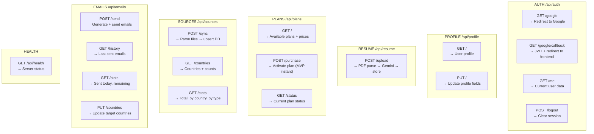

---

## 11. Complete Test Checklist (Bruno Order)

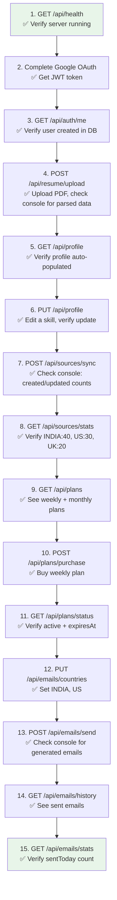
